# Mellon

# Project Overview

The purpose of this project is to provide users with a pared down microblogging experience. Many social media platforms in the current day place a strong emphasis on "the algorithm", where users have very little control over what they see. This infinite feed of content can lead to "doomscrolling", which [studies have suggested is linked to poor mental and physical health](https://www.theguardian.com/society/2022/sep/06/doomscrolling-linked-to-poor-physical-and-mental-health-study-finds).

The aim of Mellon is to focus on friendships - no algorithm, no influencers, no infinite feed, no adverts or sponsored posts. It will act as something inbetween a social network and a diary, where users can share short posts that are seen only by their friends, and can conversely check their friends' posts. The site will also provide functionality for liking and commenting on posts, as well as direct messaging users, in order to further facilitate human connection in the digital age.

### Side Note - Why Mellon?

Mellon is the Elvish word for 'friend' in Tolkien's "The Lord of the Rings" - and besides, who doesn't love a juicy melon on a summer day? Simple as that!

### A Note

This project was created under massive time constraints due to work, life events, mental illness, and various other confounding factors. Where this affected the project, it will be noted.

# Planning Stage

## Target Audience

The target audience of Mellon mainly consists of young people, 16-30, who are tired of sites like Twitter and are looking for a simpler way to connect with friends.

## Agile Methodologies

This project was designed using agile methodologies. Most features were described in user stories, which were then separated into epics to aid in the development cycle. Each epic was implemented in a sprint (due to time constraints, a sprint was more like a block of hours than days or weeks).

User stories can be found in the Product Backlog project on GitHub. There are discrepancies between this list and the product backlog; again, due to time constraints, there was not sufficient time spent on planning which means that some user stories and tasks are in the wrong milestone, and some are missed out altogether. This list is how the project was developed.

### EPIC 1: Setup

This epic included all tasks that needed to be done before work could begin on the complex parts of the project. This included:
- Set up Django app
- Create Postgresql database
- Set up static storage
- Create base.html template
    - Create site navigation and footer
- Create basic database models
- Set up admin dashboard
- Initial deployment to Heroku

### Epic 2: Authorisation

This epic included anything related to user authorisation & authentication.
- Login/out
- Register

### Epic 2: Posts & Comments

This epic included everything related to making, editing and deleting posts or comments.
- Make posts
- Comment on posts
- Like/unlike posts
- Delete post/comment
- Edit post/comment (not implemented)
- Add images to posts (not implemented)
- Flag posts (not implemented)

### Epic 3: Profiles & Friendships

This epic was not properly planned as some features slipped my mind during planning.
- View a profile
- Edit profile
- Send, accept, reject, and cancel friend requests

### Epic 4: Messaging

This epic was not implemented at all due to time constraints, and because I viewed it as an optional feature.
- Send, receive, and view messages

### Epic 5: Admin

Again, this epic was not implemented.
- Moderate posts & comments
- Warn users
- Ban users

### Epic 6: Misc

This epic consisted of miscellaneous tasks that did not fit anywhere else and were not required for any other parts of development.
- Create favicon
- Create custom 404, 403 and 500 pages

## ERD

After planning my user stories and sprints, I created an entity-relationship diagram (ERD) to plan how the database would look. 

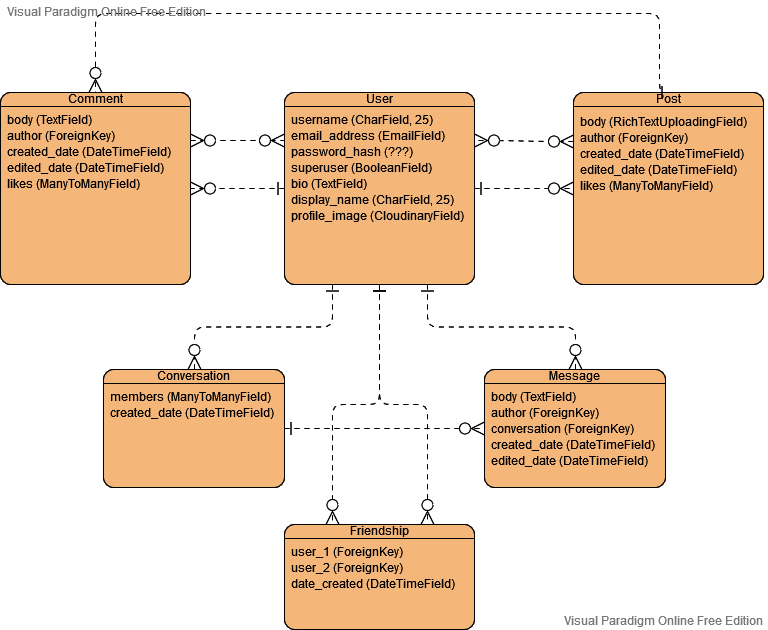

Some of the fields aren't properly defined - for example, I included password_hash in the user entity, which is inherited from Django's base User model. I wasn't sure at the point of creating the ERD how this would be implemented, so I included it as a placeholder. Overall, the fields were less important than the entities and the relationships between them, so this was mainly a tool to understand how my models would interact.

## Wireframes

Before starting development, I created wireframes to help design how pages should look.

### Home Screen (not logged in)
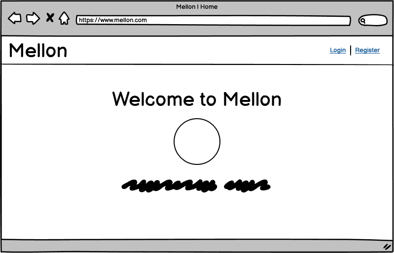

## Home Screen (logged in)
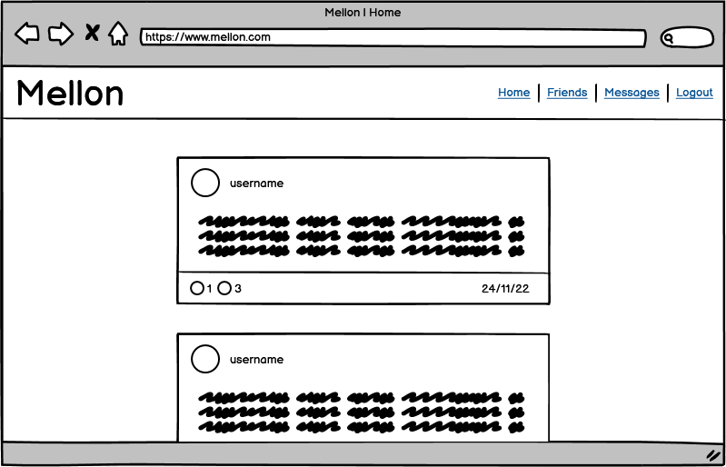]

## Login
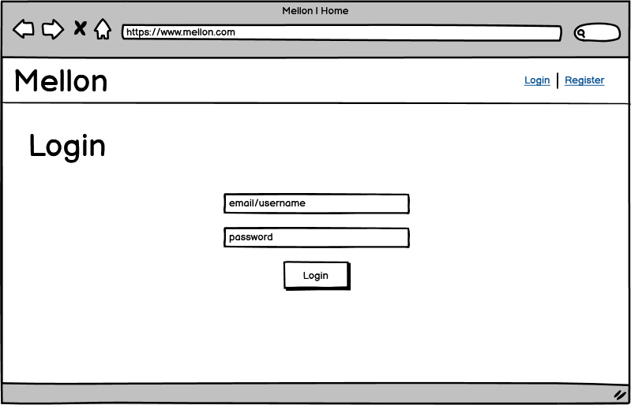

## Register
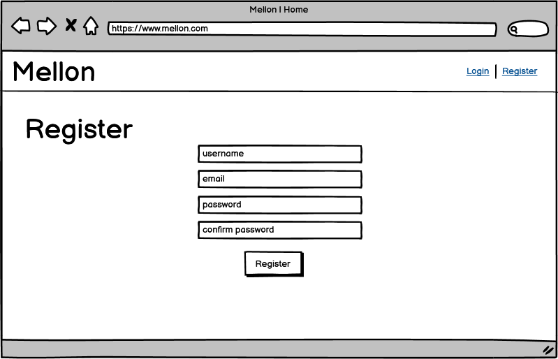

## Create Post
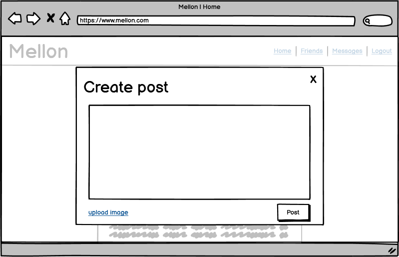

## Create Comment
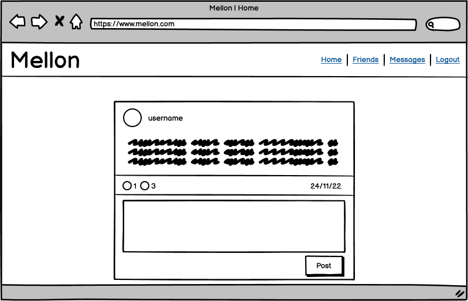

## View Comments
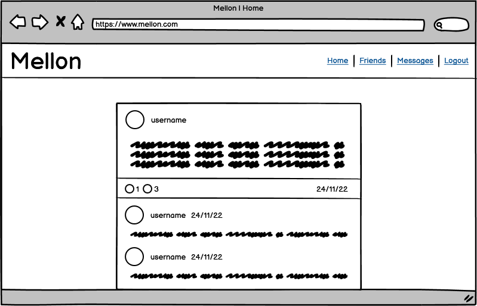

## Profile
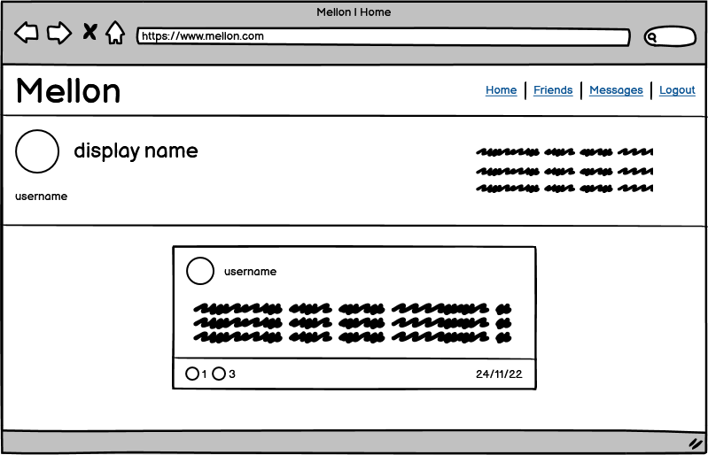

## Friends
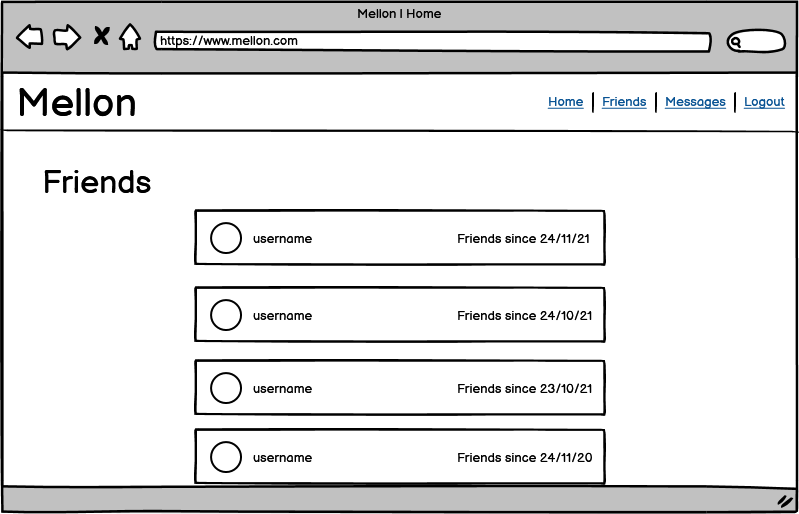

## Messages
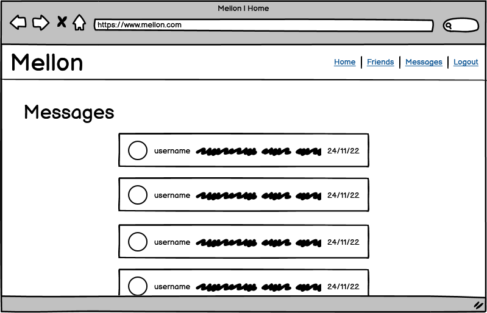

## Conversation
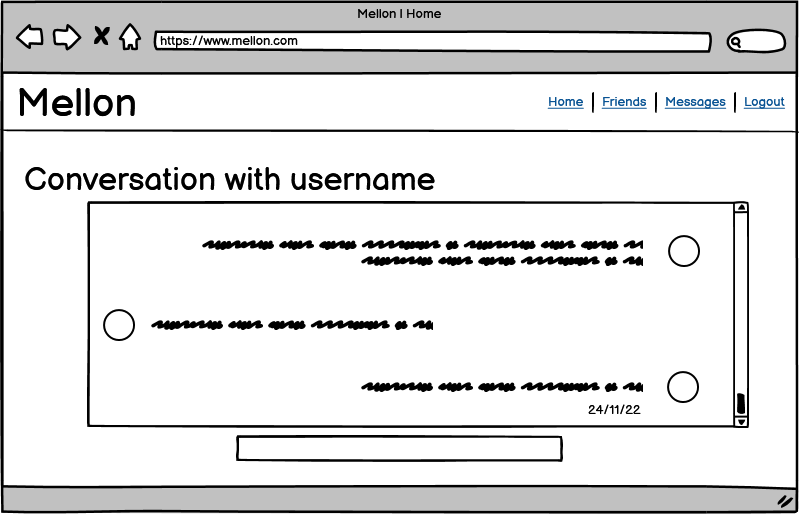

